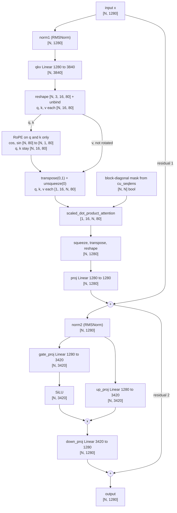

# W2-1: One Qwen2.5-VL vision-encoder block in plain PyTorch

**Setup:** Qwen2.5-VL-3B-Instruct, Kaggle T4, L4 (both noted where they differ). Vision tower: hidden size 1280, 16 heads, head_dim 80, MLP width 3420.

## Block diagram (with shapes)

N is the number of patch tokens, N = t x rows x cols from grid_thw. There is no batch axis: all images are packed into one [N, 1280] tensor and cu_seqlens marks the segment boundaries.

## Results

### fp32 match table (target: max abs diff <= 1e-3)

| Image | N | Block | Attention type | Segments | Max abs diff | Mean abs diff |
|---|---|---|---|---|---|---|
| 1: COCO 000000039769 (640x480) | 1564 | 7 | full | 1 | 0.0 | 0.0 |
| 2: same image resized to 448x448 | 1024 | 7 | full | 1 | 0.0 | 0.0 |
| 3: same image resized to 336x504 | 864 | 7 | full | 1 | 0.0 | 0.0 |
| 1 (extra check) | 1564 | 0 | windowed | 30 | 2.9e-6 | 1.6e-8 |

All rows are well under 1e-3, and identical on T4 and L4 except the block 0 mean. Piece by piece on block 7 (image 1), `norm1`, `attn`, `norm2` and `mlp` each gave max diff 0.0.

### fp16 tolerance (stated separately; block 7, image 1)

| Comparison | T4 max / mean | L4 max / mean |
|---|---|---|
| my block (fp16) vs reference block (fp16) | 0.0 / 0.0 | 1.56e-2 / 6.4e-5 |
| my block (fp16) vs reference block (fp32) | 2.09e-2 / 3.09e-4 | 2.07e-2 / 3.10e-4 |

**fp16 tolerance to state:** max abs diff about 2e-2 against fp32 (relative 6e-4 on both GPUs).

On L4 my fp16 block differs from the reference's fp16 block by up to 1.6e-2 (0.0 on T4), the same order as fp16 rounding. Likely a different fp16 attention kernel (not verified). One block, one image only.

## Findings

- **Block:** two RMSNorms, fused `qkv` + `proj`, gated SiLU MLP, bias on every Linear.
- **No batch axis:** flat `[N, 1280]` input; `cu_seqlens` becomes a block-diagonal mask. A batch axis of 1 is added only for SDPA.
- **qkv layout:** `[3, heads, head_dim]`, so `reshape(N, 3, 16, 80).permute(1, 0, 2, 3).unbind(0)`. The wrong order runs but silently gives wrong results.
- **RoPE:** q and k only, half-split `rotate_half`. Captured `cos`/`sin` are `[N, 80]` and need `unsqueeze(1)` to broadcast over heads.
- **Mask coverage:** block 7 has one segment, so it doesn't exercise the mask. Block 0 has 30 windows and matches to 2.9e-6.
- **Exact zeros are real:** same ops and kernels as the reference. Swapping SiLU for ReLU gave max diff 0.85, so the test catches errors.
- **fp16:** RMSNorm and rotary upcast to fp32 and cast back, as in the reference.