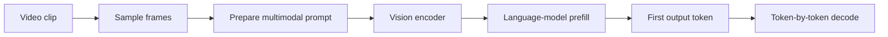
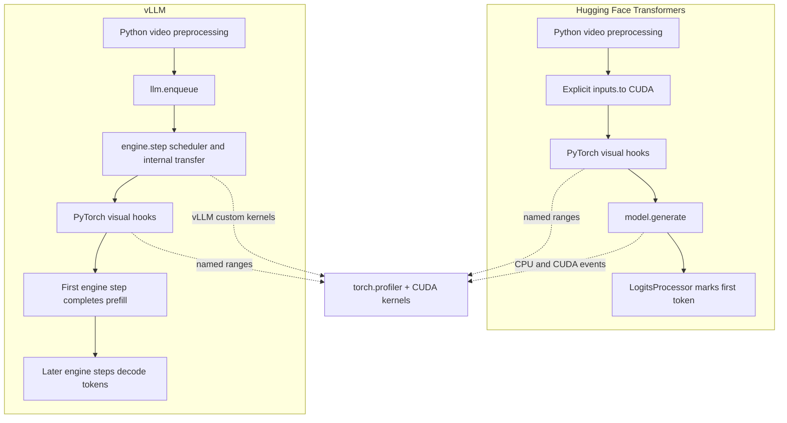

# W1-3: Hugging Face versus vLLM video profiling

This folder contains matched profiling scripts for one Qwen2.5-VL video request:

- `w1-3-hf.py` runs the model with Hugging Face Transformers.
- `w1-3-vllm.py` runs the model with vLLM.
- `comparison-results.md` compares the clean measurements from both runs.

Both scripts are configured with the same model, 8-second clip, 2 FPS sampling
rate, prompt, greedy decoding, and a limit of 32 generated tokens. Run them in
separate fresh Kaggle GPU sessions when possible, because the model and vLLM
engine occupy most of a T4's memory. A run must record its actual package
versions and hardware before it is compared with another run.

## Transformers video-cap compatibility

Transformers 5.21 warns that its Qwen2-VL video processor does not, by default,
apply the reference `qwen-vl-utils` total-video pixel budget. The warning says
that the default will become capped in v5.22. The Hugging Face script pins the
pre-change release range and passes `cap_pixels_per_frame=True` explicitly.

These benchmarks call `process_vision_info()` from `qwen-vl-utils` first and
then call the Transformers processor with `do_resize=False`. Consequently,
`qwen-vl-utils` determines the actual frame size; the explicit Transformers
flag records the intended policy and suppresses the warning, rather than
resizing a second time. For the recorded 8-second, 2-FPS request, 16 sampled
frames form eight temporal groups of 299 tokens each, or 2,392
video-placeholder tokens, so this setting does not alter the reported token
count.

## Recorded Hugging Face trace

The following supplied trace is a single clean request plus one profiler run;
the repository does not contain its raw trace or `run.json`. It therefore
supports the listed timings, but not a claim about a particular GPU, package
version, or run-to-run comparison.

`clip_08s.mp4` at 2 FPS produced 2,392 video tokens and 32 output tokens.
`clean` is the unprofiled request and supplies the percentages. `traced` is the
request inside `torch.profiler`; profiler overhead, especially during decode,
makes its wall times unsuitable for those percentages.

| Phase | Clean ms | Clean share | Traced ms | Sum of kernel time / traced phase |
|---|---:|---:|---:|---:|
| Preprocess | 760.8 | 24.7% | 588.0 | — |
| H2D | 10.1 | 0.3% | 10.1 | — |
| Encoder | 753.2 | 24.4% | 1,106.2 | 53.2% |
| Prefill | 315.0 | 10.2% | 311.4 | 98.6% |
| Decode | 1,241.9 | 40.3% | 2,237.2 | 38.6% |

## Takeaway

For this request, most delay happens before the model can produce its first
word: preprocessing, transfer, vision encoding, and prefill take 59.7% of the
total clean request. The vision encoder alone accounts for 41.0% of that
first-response time.

After the first word, generation is still substantial: the remaining 31 tokens
take about 40.1 ms each. To improve how quickly an answer starts, focus on
video preprocessing and vision encoding, such as sampling fewer frames or
using smaller frames. Improving decode targets the speed of the text stream
after the answer has begun.

The clean phases total 3,081.0 ms. About 1,839.1 ms (59.7%) elapses before the
first output token; the vision encoder is 41.0% of that time. Generation after
the first token takes 40.1 ms for each of the remaining 31
tokens. Calling this value the cost of all 32 generated tokens would be
incorrect because the first token belongs to the prefill boundary in this
instrumentation.

The five largest kernel-name aggregates in the supplied trace are 559.2 ms
(31.8%, 4,496 `aten::mm` launches), 211.8 ms (12.0%, 3,348 `aten::addmm`
launches), 140.1 ms (8.0%, 109 `aten::mm` launches), 90.3 ms (5.1%, 64
`aten::addmm` launches), and 80.1 ms (4.6%, 2,530 `aten::mul` launches).
They are aggregates over the full trace. The trace summary does not attribute
each kernel name to a phase, so it cannot by itself establish that all of the
first two aggregates belong only to decode.

## Shared request pipeline



Both frameworks must process the video before reliable text generation can
begin. The performance question is how efficiently each framework performs the
required work before the first token.

## What each profiler measures



The hooks around the vision module are PyTorch hooks in both scripts. vLLM
controls the scheduler and engine steps, while PyTorch still executes the model
modules and launches CUDA or vLLM-specific kernels.

## Preparing the Kaggle input

```bash
!mkdir -p clips
!ffmpeg -y \
  -i /kaggle/input/datasets/alphinjain/sample-videos/videos/4.mp4 \
  -t 8 -an clips/clip_08s.mp4
```

## What the phase names mean

The Hugging Face script measures:

```text
preprocess -> h2d -> encoder -> prefill -> decode
```

The vLLM script measures:

```text
preprocess -> sched_h2d -> encoder -> prefill -> decode
```

`preprocess` is Python-side video sampling, chat-template creation, and request
preparation. `h2d` is the explicit Hugging Face tensor transfer. vLLM performs
its scheduling and internal transfer itself, so the corresponding vLLM phase is
called `sched_h2d`. `encoder` is the Qwen vision tower. `prefill` is the first
language-model pass over the complete multimodal prompt. `decode` is the
remaining token-by-token generation.

The scripts use `torch.cuda.synchronize()` at phase boundaries because CUDA work
is asynchronous. They also use `record_function()` to add named ranges to the
Perfetto trace. The vLLM script disables vLLM V1 multiprocessing so the local
PyTorch profiler and vision hooks can observe the engine process.

## Running

Open each script in a fresh Kaggle GPU session after installing its dependencies.
Each run writes a timestamped output folder containing a trace and summary. Open
`video.trace.json` in https://ui.perfetto.dev for the kernel timeline.

The checked-in comparison report is a separate historical result. It is a
static report, not evidence that a later trace has the same timings; rerunning
either script creates a new measurement.
